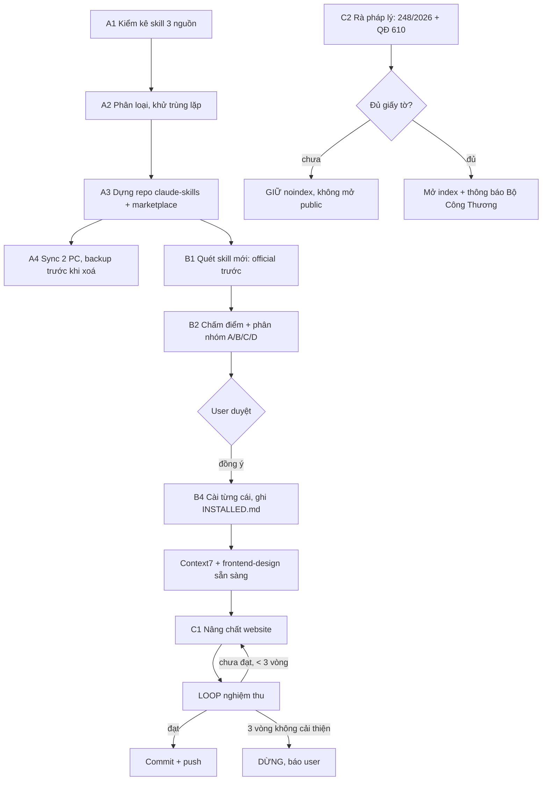

# BRIEF CHO CLAUDE CODE TRÊN PC — BELLA CELLA + KHO SKILL

> Dán toàn bộ file này vào tab Claude Code mới chạy trên PC.
> Session này KHÔNG có ngữ cảnh cũ — mọi thứ cần biết đều nằm ở đây.
> Ngôn ngữ trả lời: tiếng Việt. Không bịa. Không tự cài gì khi chưa được đồng ý.

---

## 0. BỐI CẢNH

Tôi (user) dùng **2 máy PC đều cài Claude app**. Cần một **kho skill dùng chung** mà Claude nào cũng lấy xài được.

Repo website: `2049foto/BellaCella` — Next.js 15.5.7 + React 19 + TypeScript strict + Tailwind v4.
Branch đang làm: **`claude/bellacella-design-quality-5q5c5a`** (đã push, 13 commit).
Deploy: bellacella.vercel.app (private review, đang noindex).

### Một phiên Claude Code trên cloud đã làm xong 11 mục (ĐỪNG LÀM LẠI)

| # | Mục | Trạng thái |
|---|-----|-----------|
| 0 | Form hết báo "đã gửi" giả — giờ soạn nội dung → clipboard → mở Zalo thật | ✅ |
| 1 | View Transitions native (không thư viện) + morph ảnh grid→PDP theo slug | ✅ |
| 2 | Scroll-driven reveal bằng `animation-timeline: view()` | ✅ |
| 3 | Container queries cho ProductCard, bỏ 4 media query | ✅ |
| 4 | `<dialog>` native xem ảnh cận cảnh ở PDP (Esc + click nền) | ✅ |
| 5 | loading.tsx skeleton + error.tsx / global-error.tsx | ✅ |
| 6 | Tự host font `next/font/local`, 9 woff2 subset trong `src/fonts/` | ✅ |
| 7 | Ảnh AVIF+WebP, static import, blur, sizes đúng lưới | ✅ |
| 8 | WCAG 2.2 AA — axe sạch 0 lỗi serious/critical | ✅ |
| 9 | SEO: metadata/OG card/JSON-LD/sitemap.ts/robots.ts | ✅ |
| 10 | Core Web Vitals + Lighthouse đo thật | ✅ |

### 4 QUYẾT ĐỊNH ĐÃ CHỐT — KHÔNG ĐƯỢC TỰ Ý REVERT

1. **`--ink-3` sáng đổi `#8C9094` → `#6B6F73`.** Giá trị cũ chỉ đạt ~3.0–3.2:1, chữ nhỏ trượt WCAG AA. Giá trị mới đạt 5.06:1 trên nền trắng. Bảng màu trong `CLAUDE.md` giờ lệch với `design-tokens.css` — **`design-tokens.css` là nguồn thật**.
2. **Scroll reveal CHỈ dùng `translateY`, KHÔNG fade opacity.** Lý do: opacity < 1 trên khối chứa chữ kéo tương phản hiệu dụng của chữ xuống ~1:1 khi khối còn dưới màn → axe/Lighthouse báo lỗi contrast hàng loạt. Nếu bạn thêm opacity lại là gãy WCAG.
3. **`preload: false` cho cả 2 font trong `src/app/fonts.ts`.** Preload cả 9 file (~230KB) làm nghẽn băng thông, LCP 3.4s. Tắt preload → LCP còn 1.9–2.2s. **Đừng bật lại preload.**
4. **Giữ `COMMERCE_ENABLED = false` và `robots noindex`** cho tới khi tôi nói mở.

### Baseline đo thật — không được làm tệ đi

Lighthouse **mobile**, build production, throttle 4× CPU / 1.6 Mbps:

| Trang | Perf | A11y | Best Practices | SEO | LCP | CLS | TBT |
|---|:-:|:-:|:-:|:-:|:-:|:-:|:-:|
| Trang chủ | 99–100 | 100 | 96 | 69* | 1.9–2.2s | 0.001 | 40–50ms |
| PDP | 95–97 | 100 | 100 | 69* | 2.4–2.7s | 0.003 | 30–130ms |

\* SEO 69 là **cố ý**: audit duy nhất fail là `is-crawlable` vì đang noindex. Mọi audit SEO khác pass. Mở index → SEO ~100. **Đừng "sửa" bằng cách bỏ noindex.**

axe-core (wcag2a/2aa/21aa/22aa): **0 lỗi serious/critical** trên cả 9 route, cả 2 theme. Không tràn ngang @390/768/1440.

---

## 1. GIỚI HẠN BẤT BIẾN

- **KHÔNG BỊA NỘI DUNG.** Không bịa chứng nhận, số liệu clinical, review, testimonial, before/after, tồn kho. Mọi câu trên trang phải truy được về catalogue chính thức. Đây là ràng buộc pháp lý, không phải sở thích.
- **Không suy diễn chỉ định y khoa.** Thứ tự sản phẩm chỉ là quy trình chăm sóc thông thường, phải ghi rõ theo hướng dẫn của chuyên gia điều trị.
- **Bảng màu giữ nguyên:** trắng / đen / xám lệch lạnh. **KHÔNG màu nhấn.** Màu duy nhất trên trang là màu sản phẩm trong ảnh. Đây là bản sắc clinical-luxury, không phải thiếu sót.
- **Bo góc 0. Không đổ bóng** (trừ nút Zalo nổi). **Không thêm font thứ ba** (chỉ Archivo + Be Vietnam Pro).
- Không dùng card. Ngữ pháp bố cục: đường kẻ 1px trên mỗi khối, text trái / ảnh phải.
- Token màu khai báo trong `src/styles/design-tokens.css`. **Không hardcode màu trong JSX.**
- Mọi chuyển động phải tôn trọng `prefers-reduced-motion`.
- Nội dung phải hiển thị đầy đủ khi tắt JS.

---

## 2. NHIỆM VỤ A — GOM KHO SKILL CHUNG CHO 2 PC  ⬅ LÀM TRƯỚC

Phiên cloud không đọc được máy tôi nên chưa làm được. **Bạn chạy trên PC nên làm được.**

### A1. Kiểm kê (đọc, chưa sửa gì)

Quét và lập bảng inventory 3 nguồn:

```powershell
# 1) Skill cấp user của Claude Code
Get-ChildItem "$env:USERPROFILE\.claude\skills" -Directory -EA SilentlyContinue |
  Select-Object Name, LastWriteTime

# 2) D:\APP FACTORY — tìm mọi SKILL.md
Get-ChildItem "D:\APP FACTORY" -Recurse -Filter SKILL.md -EA SilentlyContinue |
  Select-Object FullName, LastWriteTime

# 3) Plugin / marketplace đã cài
Get-Content "$env:USERPROFILE\.claude\settings.json" -EA SilentlyContinue
Get-ChildItem "$env:USERPROFILE\.claude\plugins" -EA SilentlyContinue
```

Với **mỗi** skill tìm được, đọc YAML frontmatter của `SKILL.md` và ghi: `name`, `description`, đường dẫn, ngày sửa cuối.

### A2. Phân loại

- **Trùng lặp** — cùng `name` hoặc cùng chức năng ở nhiều nơi → chọn bản mới nhất/đầy đủ nhất, ghi rõ bản nào bị loại và vì sao.
- **Hỏng** — thiếu frontmatter, thiếu `name`/`description`, SKILL.md rỗng → liệt kê để sửa.
- **Đã có ở cấp tài khoản claude.ai** — 15 skill sau **đã tự sync sang cả 2 PC rồi**, đừng nhân bản vào kho git:
  `docs`, `computer-use`, `chrome-browser`, `built-in-browser`, `deep-research`, `find-skills`, `import-memory`, `llm-council`, `morning`, `skill-creator`, `skill-updater`, `xlsx`, `pptx`, `pdf`, `docx`.

### A3. Dựng kho chung

Tạo repo riêng **`2049foto/claude-skills`** (đừng nhét vào repo BellaCella — CLAUDE.md quy định project đó độc lập). Cấu trúc:

```
claude-skills/
├─ .claude-plugin/marketplace.json   # để /plugin marketplace add dùng được
├─ skills/<tên-skill>/SKILL.md
├─ plugins/<tên-plugin>/
├─ INSTALLED.md                      # ledger: tên / nguồn / ngày / version
└─ README.md                         # hướng dẫn cài cho máy mới
```

Đồng bộ về mỗi PC — chọn 1 trong 2:

```powershell
# Cách 1 (khuyến nghị): marketplace native
/plugin marketplace add 2049foto/claude-skills
/plugin install <tên>@claude-skills

# Cách 2: clone + symlink (cần Developer Mode hoặc admin)
git clone https://github.com/2049foto/claude-skills "$env:USERPROFILE\.claude\skills-store"
New-Item -ItemType SymbolicLink -Path "$env:USERPROFILE\.claude\skills\store" `
         -Target "$env:USERPROFILE\.claude\skills-store\skills"
```

**Quy tắc:** cập nhật = `git pull` ở cả 2 máy. Không copy tay giữa 2 máy nữa.

### A4. Trước khi xoá/di chuyển bất cứ gì

Backup `%USERPROFILE%\.claude\skills` ra thư mục `.bak` kèm ngày. **Hỏi tôi trước khi xoá.**

---

## 3. NHIỆM VỤ B — QUÉT & CẬP NHẬT SKILL

Tôi đã có skill `skill-updater` ở cấp tài khoản — **dùng nó**, theo đúng quy trình 4 nhóm A/B/C/D của nó.

### Đã quét được (phiên cloud, 22/09/2026) — khỏi làm lại

`anthropics/skills` (**177.5k ★**) có 19 skill. Official mà tôi **chưa có**, khớp nhu cầu (web/app/game/thiết kế):

| Skill | Dùng để |
|---|---|
| **frontend-design** | Bỏ "AI slop", ép quyết định thiết kế có chủ đích |
| **brand-guidelines** | Giữ nhất quán bản sắc — rất hợp luật brand ngặt của BELLA CELLA |
| **webapp-testing** | Test UI bằng Playwright |
| **web-artifacts-builder** | Dựng web artifact phức tạp |
| **theme-factory**, **canvas-design** | Theming & thiết kế thị giác |
| **algorithmic-art** | Generative art (p5.js) — hữu ích cho game |
| **mcp-builder** | Viết MCP server |

MCP đáng cân nhắc (nguồn: `wilwaldon/Claude-Code-Frontend-Design-Toolkit`, 4/2026):

```
claude mcp add context7 -s user -- npx -y @upstash/context7-mcp@latest
claude mcp add playwright -s user -- npx @playwright/mcp@latest
claude mcp add chrome-devtools -s user -- npx @anthropic-ai/chrome-devtools-mcp@latest
```

**Context7 đáng giá nhất với tôi**: kéo doc đúng version của Next.js 15 / React 19 / Tailwind v4, tránh model trả lời theo trí nhớ cũ.

### Nguồn phiên cloud KHÔNG quét được → bạn quét lại giúp

- `anthropics/claude-code` **CHANGELOG** (WebFetch chỉ trả về menu, không ra nội dung) → cần feature mới 8–9/2026.
- **X/Twitter** — bị chặn.
- Con số "Frontend Design ~277k lượt cài" do blog bên thứ ba nêu, **chưa xác minh từ nguồn Anthropic**.

### Quy tắc
Không tự cài. Chỉ đề xuất + đưa lệnh, tôi duyệt rồi mới cài. Cài từng cái một, restart Claude, kiểm tra, rồi mới cài tiếp. Ghi ledger vào `INSTALLED.md` **sau khi** tôi xác nhận đã cài.

---

## 4. NHIỆM VỤ C — HOÀN THIỆN WEBSITE

Mục tiêu: đạt chuẩn website mỹ phẩm hiện đại nhất **mà không vi phạm mục 1**.

### C1. Nghiên cứu đã có (phiên cloud) — tính năng chuẩn ngành 2026

Tính năng các site mỹ phẩm DTC top đang dùng, kèm phán quyết cho trường hợp của tôi:

| Tính năng | Giá trị | Làm được không? |
|---|---|---|
| Ingredient transparency / glossary có dẫn nguồn | Cao | ✅ **Đã có** (`/kien-thuc`) — đây là tài sản mạnh nhất, nên khai thác sâu hơn |
| Skin-concern quiz → gợi ý bộ sản phẩm | Rất cao (báo cáo +25% CR) | ⚠️ **Chỉ được** làm dạng "tìm sản phẩm theo nhu cầu", **cấm** kết luận y khoa, phải ghi rõ theo chỉ dẫn chuyên gia |
| Routine builder | Cao (AOV $130–200 vs $75–110) | ⚠️ Làm được dạng "gợi ý thứ tự dùng" — đã có nền ở `/lieu-trinh` |
| Review / UGC / before-after | Rất cao | ❌ **CẤM** — chưa có review thật, bịa là vi phạm |
| AI skin analysis / shade matching | Cao | ❌ Không có dữ liệu, lại chạm y khoa |
| Giỏ hàng / thanh toán | — | ❌ Giữ `COMMERCE_ENABLED=false` |
| Educational content hub | Cao | ✅ Mở rộng `/kien-thuc` |

**Xu hướng thiết kế 2026** (Awwwards & tổng hợp): kinetic/bold typography, scroll-driven animation đã baseline mọi trình duyệt, view transitions, broken grid, restraint thay vì hiệu ứng phô. **Site đã có View Transitions + scroll-driven CSS rồi** — đang đúng xu hướng. Hướng nâng tiếp: kinetic typography tiết chế cho wordmark/heading, chuyển cảnh theo chương.

### C2. ⚠️ PHÁP LÝ — MỚI, QUAN TRỌNG

Phát hiện khi tra (22/09/2026):

- **Luật Thương mại điện tử 2025**, nghị định hướng dẫn **248/2026/NĐ-CP**, hiệu lực **01/07/2026**: website TMĐT **có chức năng đặt hàng/thanh toán** phải **thông báo với Bộ Công Thương** (online.gov.vn).
  → Hiện site **chưa có chức năng đặt hàng** nên có thể coi là website giới thiệu. **Ngay khi bật giỏ hàng là phải làm thủ tục thông báo trước.**
- **27/07/2026**: Cục Quản lý Dược ra **QĐ 610/QĐ-QLD thu hồi một số số công bố mỹ phẩm**.
  → **Phải đối chiếu 8 SKU với danh sách thu hồi** trước khi mở site công khai.
- Vẫn thiếu (đã ghi trong CLAUDE.md): **số tiếp nhận phiếu công bố mỹ phẩm cho cả 8 SKU**, **chứng nhận SPF cho Sun Cushion**, ảnh gốc độ phân giải cao + logo vector.
  → **KHÔNG mở site công khai trước khi có đủ.**

### C3. Việc kỹ thuật còn lại

1. **Next.js 15.5.7 có cảnh báo lỗ hổng bảo mật** (`npm install` báo). Cân nhắc nâng lên bản vá — chạy `npm audit`, nâng patch, build lại, chạy full acceptance loop.
2. PDP LCP 2.4–2.7s, sát ngưỡng 2.5s. Nguyên nhân: CPU-bound sau FCP (ảnh LCP chỉ 9KB nên không phải băng thông). Thử giảm JS đầu vào cho route PDP.
3. Best Practices trang chủ 96 (PDP 100) — tìm audit lệch và vá nếu rẻ.
4. Hai mục `needsReview` trong `products.ts` (Toner Pad 200ml vs nhãn 180ml/70EA; Sun Cushion 200ml cho dạng phấn nước) — vẫn chờ nhà sản xuất xác nhận, **không tự sửa số**.

---

## 5. GRAPH PHỤ THUỘC



Thứ tự bắt buộc: **A → B → C**. Lý do: cài `frontend-design` + `context7` **trước** rồi mới sửa website thì chất lượng output cao hơn hẳn.

---

## 6. LOOP NGHIỆM THU — BẮT BUỘC SAU MỖI MỤC

Không được "cảm giác là xong". Phải đo.

```
1. npm run build          # phải xanh, 0 lỗi TS
2. npm start              # BUILD PRODUCTION, không phải dev server
3. Playwright: chụp 390 / 768 / 1440 × {light, dark}
   + assert document.documentElement.scrollWidth === clientWidth (không tràn ngang)
4. axe-core: tags wcag2a,wcag2aa,wcag21a,wcag21aa,wcag22aa
   → PHẢI 0 lỗi serious/critical
5. Lighthouse mobile trên build production
   → Perf ≥90, A11y ≥95, BP ≥95 (SEO 69 là đúng, do noindex)
6. Chưa đạt → sửa → lặp lại. TỐI ĐA 3 VÒNG/MỤC.
   3 vòng không cải thiện → DỪNG, báo tôi số thật + nguyên nhân.
7. Commit riêng từng mục. Báo sau mỗi mục, đừng đợi hết mới báo.
```

**Bẫy đã dính, tránh lặp lại:**
- Sau khi `npm run build`, **phải restart `npm start`**. Server cũ phục vụ asset hash cũ → CSS trả về **400**, trang mất sạch style, và axe sẽ báo "contrast sạch" một cách **giả** (vì không CSS thì chữ đen trên nền trắng). Luôn verify `curl <css-url>` trả 200 trước khi tin kết quả đo.
- Khi đo scroll-driven animation: cuộn hết trang rồi assert mọi khối `opacity === 1`, tránh bug khối cuối kẹt ẩn.

Mọi ngưỡng trên cũng nằm trong skill `.claude/skills/bella-acceptance/SKILL.md` của repo — đọc nó trước khi commit.

---

## 7. BÁO CÁO CUỐI TÔI MUỐN

Bảng: **từng mục | xong/chưa | số đo trước | số đo sau**.
Kèm 4 điểm Lighthouse của trang chủ + 1 PDP.
**Nói rõ mục nào chưa đạt và vì sao** — báo số thật, không báo "đã tối ưu".

---

## 8. QUY TẮC LÀM VIỆC

- Tiếng Việt. Thẳng, không nịnh.
- Không tự cài skill/plugin khi tôi chưa đồng ý.
- Không xoá file nào trong `.claude/skills` khi chưa backup + chưa hỏi.
- Không bịa link, không bịa số star, không bịa kết quả đo. Không fetch được thì ghi "chưa xác minh".
- Nguồn nào quét thất bại phải liệt kê ra, không im lặng bỏ qua.
- Không mở PR nếu tôi không yêu cầu.
